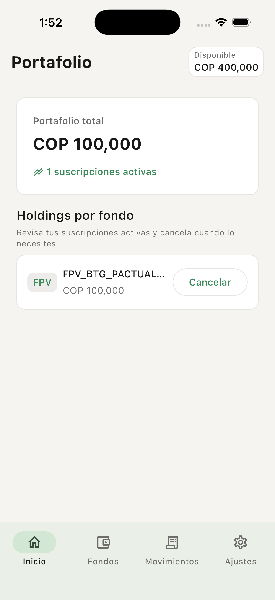
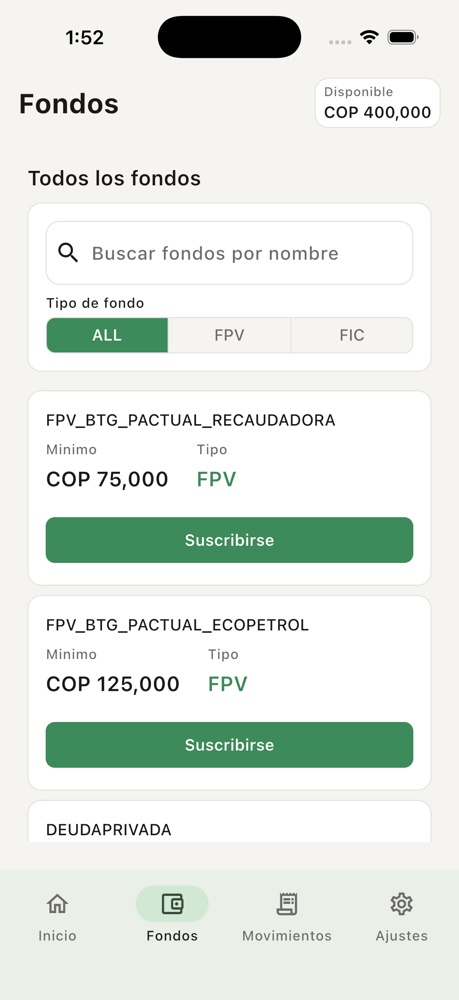
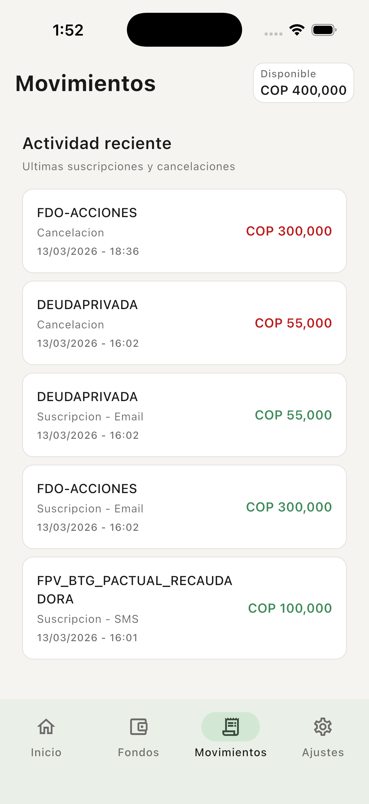
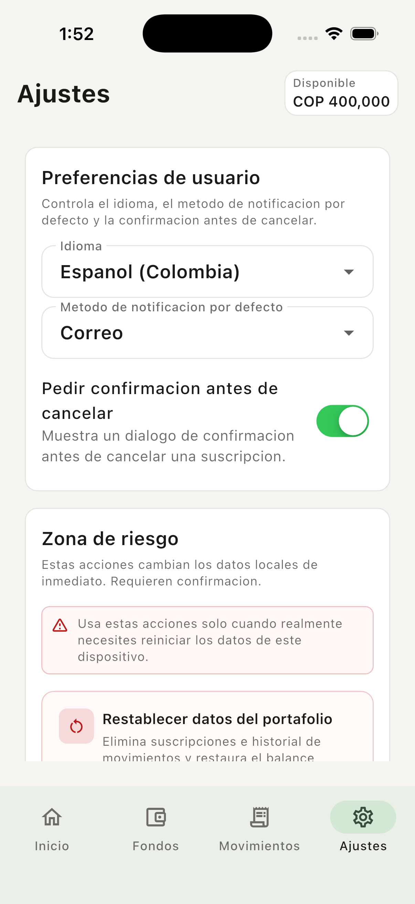

# Amaris Consulting - Flutter Senior Tech Test

[](https://github.com/krrskl/amaris-test/actions/workflows/deploy-web.yml)

Live demo: https://d2qqk58zw2zndr.cloudfront.net

Cross-platform Flutter technical test focused on responsive architecture, business-rule correctness, and production-minded engineering practices.

## 1) Project Overview

This project implements a fund management experience for FPV/FIC products with:

- Responsive shell for mobile, tablet, and web
- Portfolio subscription and cancellation workflows
- Persisted local state (balance, holdings, transaction history, preferences)
- Internationalization (`en`, `es_CO`) with runtime language switching

Scope includes base product flows and architecture quality gates for a senior-level submission.

## 2) Live Demo and Media

- Web demo video: `screenshots/web-demo.mp4`
- Mobile demo video: `screenshots/mobile-demo.mp4`

Screenshots:

<div align="center">
  
  
</div>

<div align="center">
  
  
</div>

## 3) Architecture (High-Level)

- Flutter 3 + Dart
- Riverpod state management
- Feature-oriented organization with shared `core/`
- Repository pattern for data access
- `hive_ce` persistence for portfolio and user preferences
- `slang_flutter` for localization

## 4) Key Business Rules (PRD Core)

- Subscription amount must be >= fund minimum
- Subscription requires available balance
- Notification channel is mandatory for subscription
- Cancellation credits original subscribed amount back to available balance

## 5) Localization

- Supported locales: `en`, `es_CO`
- Default locale: `en`
- Language selector available in Settings
- Persisted language preference restored on startup

## 6) Responsive Strategy

- Breakpoints:
  - Compact: `< 600`
  - Medium: `>= 600 and < 1024`
  - Expanded: `>= 1024`
- Navigation adapts by size class:
  - Bottom navigation (compact)
  - Navigation rail (medium)
  - Side panel (expanded)

## 7) Testing Strategy (Core)

The retained suite focuses on high-value checks:

- Domain business rules
- Notifier transitions for critical flows
- Repository persistence contracts (including corruption behavior)
- Responsive shell navigation adaptation smoke test
- Critical subscription dialog widget flow

## 8) Run Locally

```bash
flutter pub get
dart run build_runner build --delete-conflicting-outputs
flutter run
```

Optional: use VS Code launch configs in `.vscode/launch.json`.

## 9) Deployment (AWS + SST + GitHub Actions)

Workflow: `.github/workflows/deploy-web.yml`

Infra directory: `aws/`

Core deployment model:

- Static hosting on S3
- CloudFront CDN
- SST-managed infrastructure
- GitHub OIDC authentication (no long-lived AWS credentials)

Required repository configuration:

- Secret: `AWS_GITHUB_OIDC_ROLE_ARN`
- Variable: `AWS_REGION` (optional, defaults to `us-east-1`)
- Variable: `SST_STAGE` (optional, defaults to `production`)

Automatic deploy is triggered on push to `main`.

## 10) Quality Gates

```bash
flutter analyze
flutter test
```
